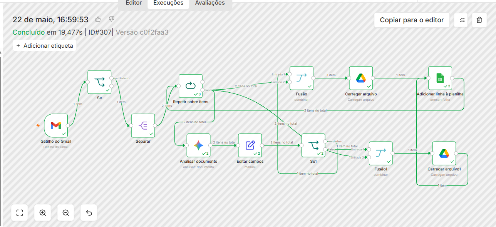
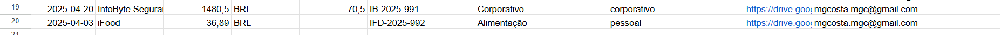
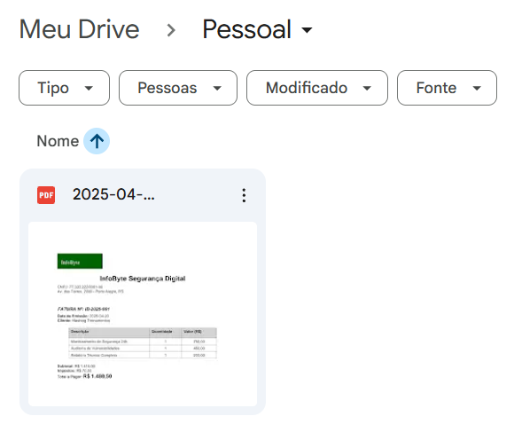
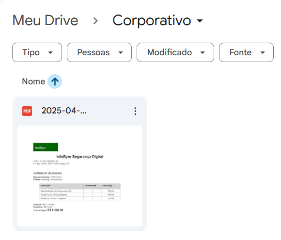

```markdown id="e2zk0n"
# Agente de Processamento de Faturas de IA

## Objetivo

Automatizar o processamento de notas fiscais e faturas recebidas por e-mail utilizando Inteligência Artificial Generativa e automações com n8n.

O fluxo realiza a leitura automática de anexos PDF recebidos por e-mail, extrai informações relevantes utilizando Google Gemini e registra os dados estruturados no Google Sheets, além de organizar os arquivos automaticamente no Google Drive.

---

## Tecnologias utilizadas

- n8n
- Google Gemini
- Gmail Trigger
- Google Drive
- Google Sheets

---

## Fluxo do processo

1. Recebe e-mail com anexo PDF
2. Identifica e separa os arquivos recebidos
3. Analisa o documento utilizando Google Gemini
4. Extrai dados da fatura automaticamente
5. Classifica a despesa (Corporativo ou Pessoal)
6. Salva o arquivo na pasta correta do Google Drive
7. Registra as informações estruturadas no Google Sheets

---

## Evidências

### Workflow completo


---

### Execução concluída com sucesso



---

### Resultado estruturado no Google Sheets



---

### Drive Pessoal



---

### Drive Corporativo



---

## Arquivo do Workflow

O arquivo `n8n_workflow_sanitized.json` contém o workflow exportado sem credenciais sensíveis.

---

## Objetivo técnico do projeto

Este projeto foi desenvolvido com foco em:

- Automação inteligente de processos
- Extração de dados com IA Generativa
- Processamento automatizado de documentos
- Integração entre ferramentas Google
- Orquestração de workflows utilizando n8n

---

## Observações

As credenciais e informações sensíveis foram removidas do workflow antes da publicação no GitHub.
```
