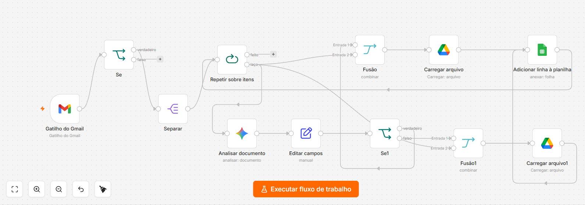
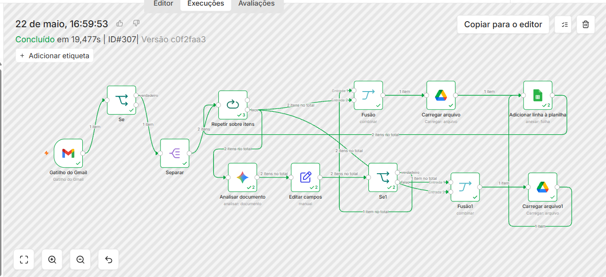

# Invoice Processing Agent for n8n

## Overview

This n8n workflow automates the processing of invoices and receipts received by email. It monitors a Gmail inbox for PDF attachments, uses Google Gemini to extract structured data from each document, classifies the expense as corporate or personal, stores the file in the corresponding Google Drive destination, and logs the extracted data in Google Sheets.

## Use Case

Manually downloading invoices from email, reading them, and logging their details into a spreadsheet is repetitive and error-prone. This workflow is useful for freelancers, consultants, or small businesses who need to keep a record of invoices/receipts (corporate and personal) without manually handling each attachment.

## How It Works

1. Gmail Trigger monitors incoming messages.
2. Workflow checks for PDF attachments.
3. Attachments are processed individually.
4. Google Gemini extracts structured invoice data.
5. Invoice is classified as corporate or personal.
6. File is uploaded to the appropriate Google Drive destination.
7. Metadata is recorded in Google Sheets.

## Features

- Automatic Gmail polling for new messages with attachments.
- Filtering of items that don't contain a PDF attachment.
- Batch processing of multiple attachments per email.
- AI-based extraction of invoice fields (date, vendor, amount, currency, tax, invoice number, category, payment method, suggested file name).
- Automatic classification of each invoice as corporate or personal.
- Separate Google Drive upload destinations depending on the classification.
- Centralized logging of all processed invoices in a Google Sheet.

## Workflow Architecture

- **Gmail Trigger** – polls the mailbox every minute and downloads attachments.
- **Has PDF Attachment?** – filters out emails that don't contain an attachment.
- **Split Out / Loop Over Items** – splits multiple attachments and processes them one at a time.
- **Analyze document** – sends the PDF to Google Gemini and requests structured JSON data.
- **Edit Fields** – normalizes the Gemini response into a usable JSON object.
- **Is Corporate Invoice?** – routes the item based on the extracted `tipo` field.
- **Merge Corporate File + Metadata / Merge Personal File + Metadata** – recombine the binary file with its extracted metadata for each branch.
- **Upload to Corporate Drive / Upload to Personal Drive** – upload the file to the corresponding Google Drive destination.
- **Append row in sheet** – writes the extracted metadata to Google Sheets.

The workflow also includes sticky notes on the canvas summarizing the overview and the configuration required for each service.

## Requirements

- An n8n instance. A recent version of n8n is recommended.
- A Gmail account to monitor.
- Access to Google Gemini (via the `@n8n/n8n-nodes-langchain.googleGemini` node).
- A Google Drive account with at least two destination folders (or shared drives) — one for corporate invoices, one for personal invoices.
- A Google Sheets spreadsheet to log the extracted data.

## Required Credentials

The following credentials must be created and assigned inside n8n after importing the workflow:

- **Gmail OAuth2** – used by the Gmail Trigger node.
- **Google Gemini credential** – used by the Analyze document node.
- **Google Drive OAuth2** – used by the Upload to Corporate Drive and Upload to Personal Drive nodes.
- **Google Sheets OAuth2** – used by the Append row in sheet node.

Credentials are NOT included in the template. Each user must configure their own credentials after import.

## Installation

1. Download or clone the repository.
2. Import `ai-invoice-processing-agent.json` into n8n.
3. Configure all required credentials.
4. Configure Gmail Trigger.
5. Replace `[NOME_DA_SUA_EMPRESA]` in the Gemini prompt.
6. Configure the Corporate Drive destination.
7. Configure the Personal Drive destination.
8. Configure the Google Sheets spreadsheet and worksheet.
9. Save the workflow.
10. Test before activating.

## Configuration Guide

### Gmail

Open the **Gmail Trigger** node and assign your Gmail OAuth2 credential. The node polls every minute (`everyMinute`) and downloads attachments automatically (`downloadAttachments: true`). No mailbox filters are pre-configured — add filters on this node if you want to restrict which emails are picked up.

### Google Gemini

Open the **Analyze document** node and assign your Google Gemini credential. The node is configured to use `models/gemini-2.5-flash`. The prompt contains a placeholder, `[NOME_DA_SUA_EMPRESA]`, used in the classification rule that checks whether the invoice was issued to your company. Replace it with your actual company name before activating the workflow.

### Corporate Drive

Open the **Upload to Corporate Drive** node. The `driveId` field currently contains the placeholder value `GOOGLE_DRIVE_URL_REMOVED` and `folderId` is set to `root`. Replace the drive with your own destination (shared drive or "My Drive") and select the folder where corporate invoices should be stored.

### Personal Drive

Open the **Upload to Personal Drive** node. Like the corporate node, `driveId` contains the placeholder `GOOGLE_DRIVE_URL_REMOVED` and `folderId` is set to `root`. Replace it with the drive/folder where personal invoices should be stored. Make sure this destination is different from the corporate one.

### Google Sheets

Open the **Append row in sheet** node. The `documentId` field currently contains the placeholder value `GOOGLE_SHEETS_URL_REMOVED` and the `sheetName` references a tab from the original spreadsheet, which will not exist in your copy. Select your own spreadsheet and worksheet, then verify that the column mapping (`Data da Fatura`, `Fornecedor`, `Valor`, `Moeda`, `Impostos`, `Número da Fatura`, `Categoria`, `Método de Pagamento`, `Corporativo ou Pessoal`, `URL do Arquivo`, `E-mail de Origem`) matches your sheet's headers.

## Extracted Data

The Gemini prompt requests the following JSON schema for each processed document:

| Field | Type | Description |
|---|---|---|
| `data_fatura` | string \| null | Invoice date (`YYYY-MM-DD`) |
| `fornecedor` | string \| null | Vendor/supplier name |
| `valor` | number \| null | Invoice amount |
| `moeda` | string \| null | Currency |
| `impostos` | number \| null | Tax amount |
| `numero_fatura` | string \| null | Invoice number |
| `categoria` | string \| null | Expense category (e.g. "Servicos", "Alimentação") |
| `tipo` | `"corporativo"` \| `"pessoal"` \| null | Corporate/personal classification |
| `metodo_pagamento` | string \| null | Payment method |
| `nome_sugerido_arquivo` | string | Suggested file name |

`tipo` and `categoria` serve different purposes and should not be confused:

- **`tipo`** — the corporate/personal classification used for routing the invoice to the correct Drive destination.
- **`categoria`** — the expense category (e.g. "Servicos", "Alimentação"), independent of whether the invoice is corporate or personal.

## Corporate vs Personal Routing

The **Is Corporate Invoice?** node checks the extracted `tipo` field:

- If `tipo == "corporativo"`, the invoice follows the corporate branch (Merge Corporate File + Metadata → Upload to Corporate Drive).
- Otherwise, the invoice follows the personal branch (Merge Personal File + Metadata → Upload to Personal Drive).

## Testing

Before activating the workflow, run a manual test:

1. Send an email with a PDF invoice attached to the monitored Gmail account.
2. Trigger the workflow manually (or wait for the next poll) and verify that the invoice data was correctly extracted.
3. Confirm that the file was uploaded to the expected Google Drive destination (corporate or personal, depending on the invoice).
4. Confirm that a new row with the extracted metadata was added to the Google Sheet.

## Security

- Credentials are not included in this template.
- Users must configure their own credentials for Gmail, Google Gemini, Google Drive, and Google Sheets.
- Never hardcode secrets, API keys, or tokens into the workflow.
- Review the Gemini prompt before production use, particularly the classification rule referencing your company name.

## Limitations

- The workflow expects PDF attachments; other file types are not processed.
- Extraction quality depends on the quality and structure of the source document.
- Drive and Sheets destinations must be manually configured — none are provided by default.
- No advanced error-handling flow is currently included (e.g. no handling for malformed AI responses or failed uploads).

## Troubleshooting

- **Gmail trigger not firing** — verify the Gmail OAuth2 credential is valid and that the workflow is activated.
- **Gemini credential not configured** — the Analyze document node will fail until a valid Google Gemini credential is assigned.
- **Invalid Drive destination** — the `driveId`/`folderId` placeholders must be replaced with a real drive and folder before uploads will succeed.
- **Google Sheets destination not selected** — the `documentId`/`sheetName` placeholders must be replaced with your own spreadsheet and worksheet.
- **Incorrect company placeholder** — if `[NOME_DA_SUA_EMPRESA]` is not replaced, invoices may not be classified as corporate correctly.
- **AI returning unexpected output** — check the raw Gemini response in the execution log; the prompt requires a pure JSON response, and unexpected formatting (e.g. extra text or markdown) can cause downstream nodes to fail.

## Customization

This workflow can be adapted to different needs, including:

- The Gemini prompt (fields extracted, formatting rules, language).
- The corporate/personal classification rules.
- The Google Drive destinations.
- The Google Sheets structure and column mapping.
- The Gmail polling interval and filters.

## Repository Structure

```
.
├── README.md
├── ai-invoice-processing-agent.json
└── imagem/
    ├── 01-workflow-completo.png
    └── 02-execucao-sucesso.png
```

## Evidence

### Full workflow


### Successful execution


## License

This repository does not currently include a license file. Licensing terms have not yet been defined.

## Disclaimer

This template should be tested in a non-production environment before activation.
